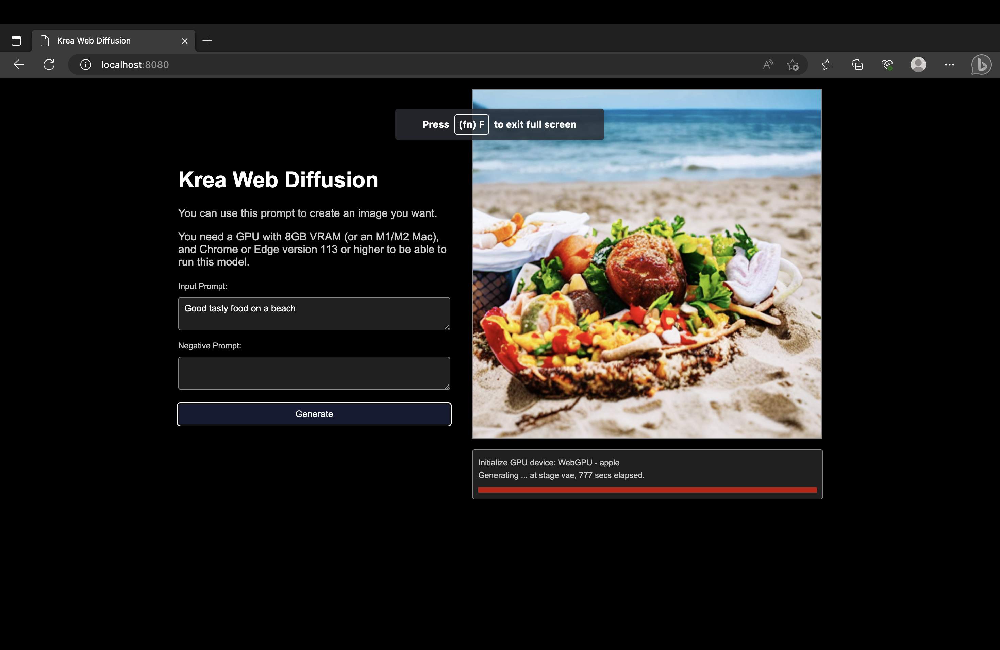

# Krea web diffusion

Installing http-server
Once you have Node.js installed, you can install http-server globally on your system by running the following command in your terminal:

```bash
npm install -g http-server
```

After successful installation, you'll be able to run http-server from the command line.

### Running the Project
To start the project, navigate to the project directory and run the following command:

```bash
http-server
```

Now navigate to the localhost:8080 and then type in the prompt and it will generate the model

Note: This is a 2GB model so it might take around 10 min to get the process done, but with further optimizations this can be easily done. 

I used part of the tvmjs code and then integrated with webgpu to get stuff running on the browser. I also can generate multiple images but have not added this feature here. 

It was hard to generate images in the browser with the python code I wrote earlier so I used native javascript to come up with this small project.

Image:

I generated the following image in my browser using webgpu

<p align="center">
  
</p>